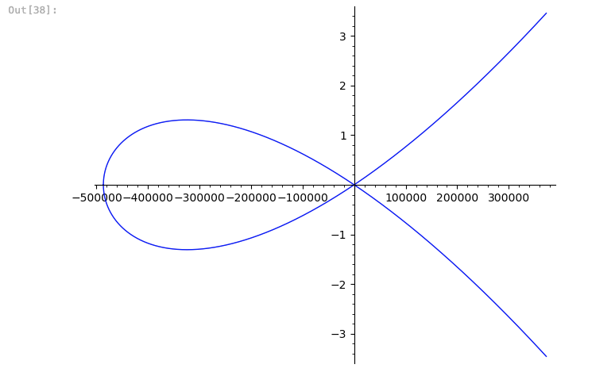
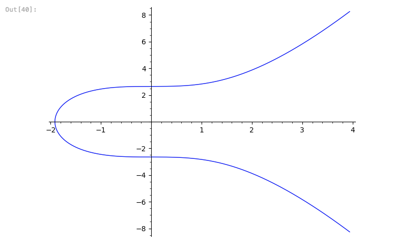

# Elliptic-Curve-Weierstrass
Curve25519, Secp256k1 Plot from Weierstrass polynomial form

## Introduction
This project is a simple implementation of elliptic curve plotting using the Weierstrass polynomial form. The project is written in Sage and uses the Elliptic Curve Constructor library for plotting.

## Requirements
1. SageMath
2. Jupyter Notebook

## To get the Equation of the curve i used this website 
[SafeCurves](https://safecurves.cr.yp.to/equation.html)

## To figure out how to use the Elliptic Curve Constructor library
[Elliptic Curve Constructor](https://github.com/sagemath/sagesmc/blob/master/src/sage/schemes/elliptic_curves/constructor.py)

Go to the link above to line 368 and the function EllipticCurve_from_Weierstrass_polynomial(f) and you will see the parameters that you can use to plot the curve in a comment inside the function.

## Curve25519

## Secp256k1

